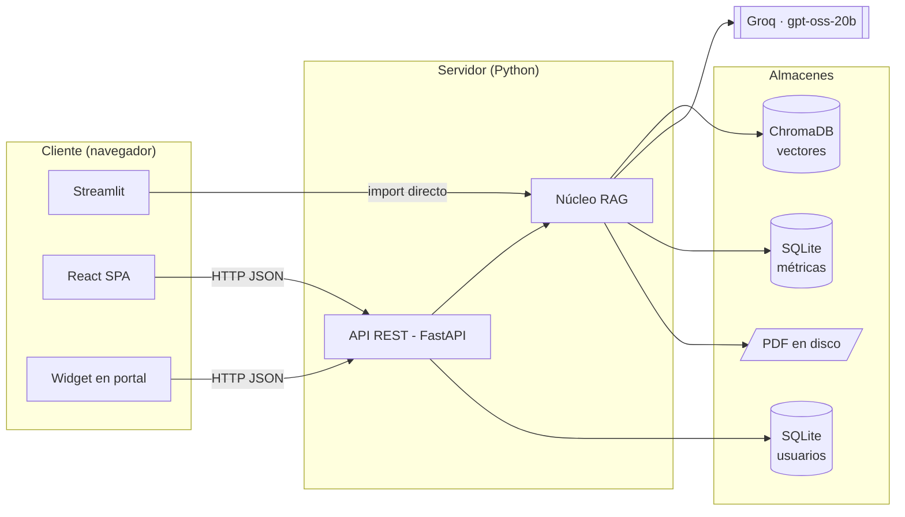
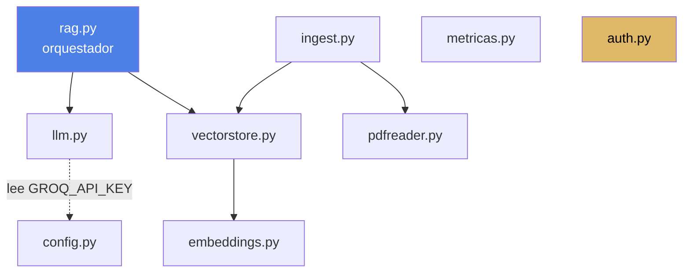
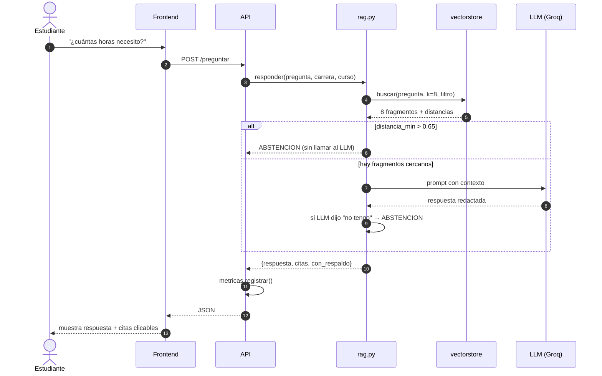
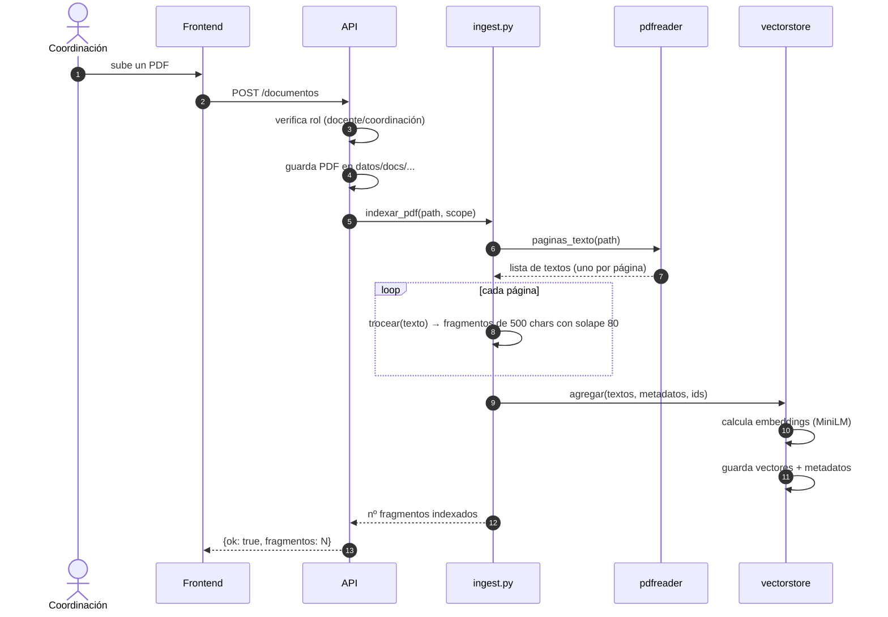
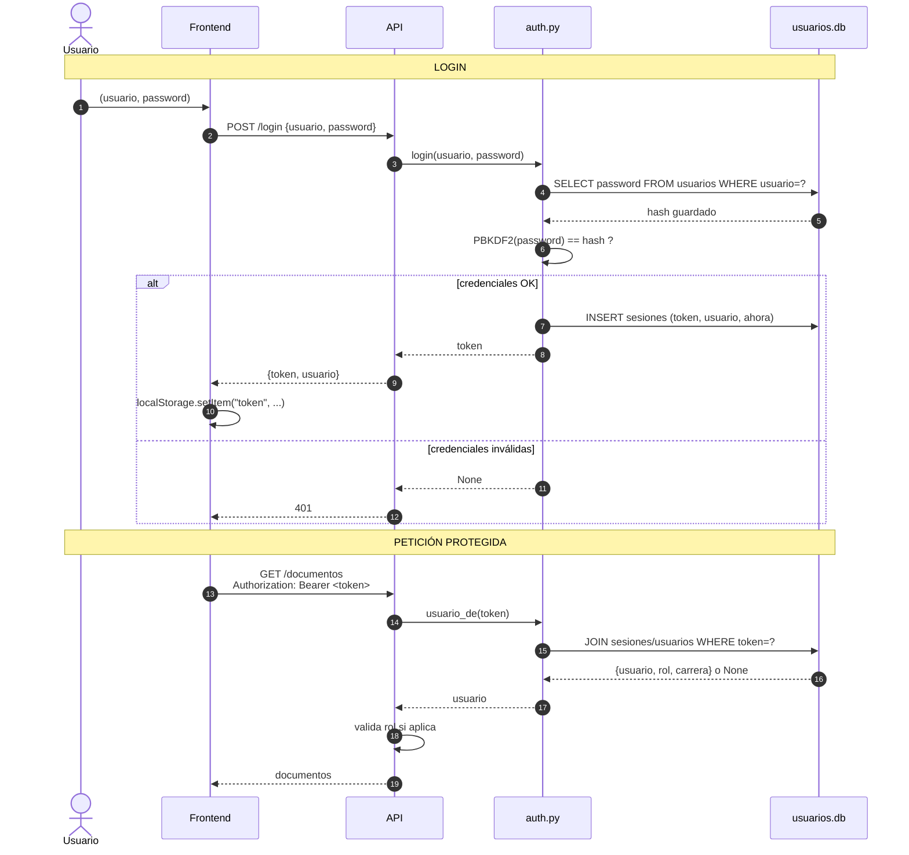

# Diseño de la arquitectura

## Vista de contenedores (nivel C4-2)

**Puntos clave:**
- Streamlit es la única interfaz que llama al núcleo directamente. Las
  otras dos pasan por la API REST. Esto se hizo así porque Streamlit
  vive en el mismo proceso Python, mientras React y el widget son
  clientes remotos.
- El núcleo NO conoce las interfaces. Se puede sumar una cuarta
  (Telegram bot, app móvil...) sin tocar `nucleo/`.

---

## Vista de componentes del núcleo (nivel C4-3)

Cada archivo es un **adaptador** de una herramienta concreta. Cambiar
la herramienta = reescribir el archivo, sin tocar el resto.

Ejemplos:
- Sustituir ChromaDB por Qdrant → reescribir `vectorstore.py`.
- Sustituir Groq por OpenAI → reescribir `llm.py`.
- Sustituir MiniLM por multilingual-e5 → una línea en `embeddings.py`.

---

## Flujo de una consulta

---

## Flujo de la ingesta

---

## Flujo de autenticación

---

## Requisitos no funcionales (cómo los cumplimos)

| Requisito | Cómo se cumple | Dónde se ve |
|---|---|---|
| RNF1 · Precisión con respaldo documental | Umbral 0.65 + prompt restrictivo + cita literal | `rag.py:responder` |
| RNF2 · Trazabilidad | Cada respuesta incluye archivo + página exacta | `rag.py:citas`, visor PDF |
| RNF3 · Latencia < 8 s | Recuperación ~17 ms + LLM ~1 s = ~1 s típico | Medido en `evaluacion/evaluacion.py` |
| RNF4 · Privacidad | Métricas sin identificador de usuario | `metricas.py` |
| RNF5 · Extensibilidad | Adaptadores aislados | núcleo modular |
| RNF6 · Autenticación por rol | Login con hash + tokens + `_exigir` por endpoint | `auth.py`, `api.py` |

---

## Decisiones que conviene defender explícitamente

1. **Orquestación propia (sin LangChain).** El flujo cabe en 100 líneas
   y mantenerlo explícito nos permite intercambiar componentes.
2. **Groq como proveedor LLM por defecto.** Cuota gratuita generosa,
   sin tarjeta. Modelo actual: `openai/gpt-oss-20b`.
3. **Chunk = 500 caracteres con solape 80.** Medido en 3 tamaños
   (300/500/800). 500 fue el óptimo (ver `RESULTADOS_PRUEBAS.md`).
4. **PBKDF2-HMAC-SHA256 con 200.000 iteraciones para passwords.**
   Estándar NIST, sin dependencias externas (viene con Python).
5. **Token opaco en tabla en vez de JWT.** Más simple, revocación
   instantánea, no requiere clave de firma.
6. **Tres frontends, un solo backend.** Demuestra que la arquitectura
   está bien desacoplada.
