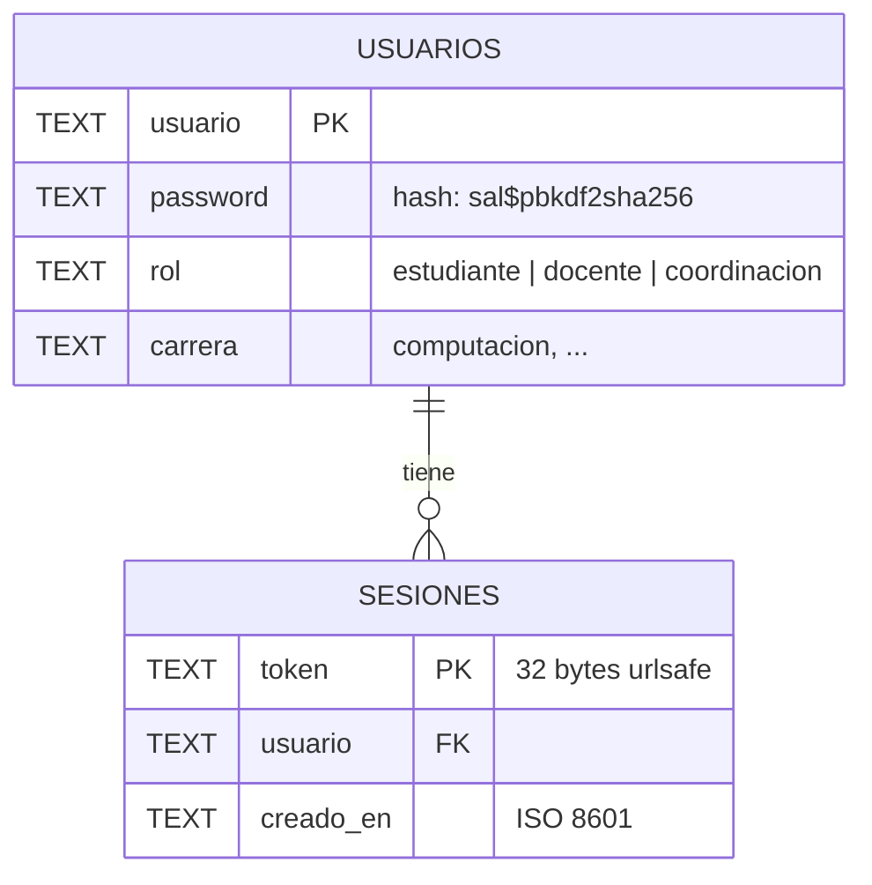
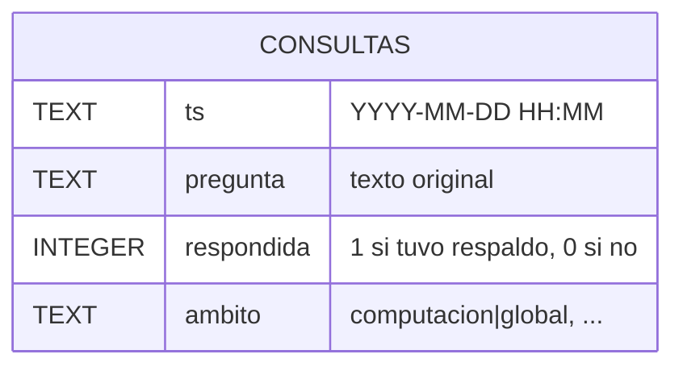
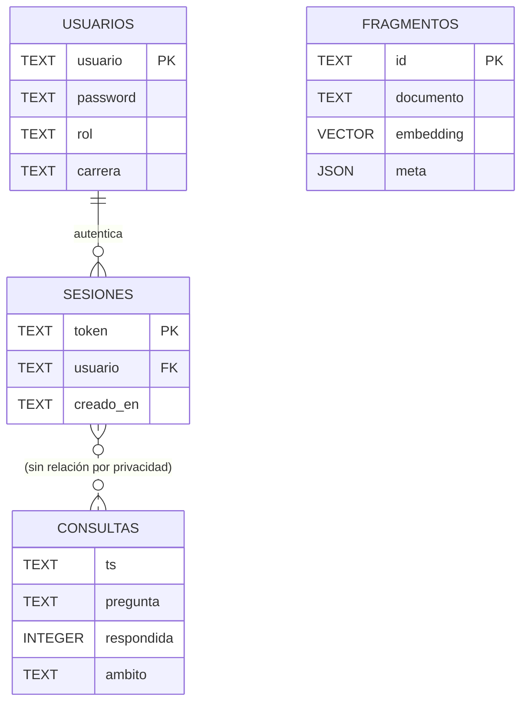

# Diseño de base de datos

El sistema usa **tres almacenes distintos** por conveniencia funcional:

| Almacén | Tecnología | Archivo | Qué guarda |
|---|---|---|---|
| Vectores | ChromaDB | `datos/chroma_db/` | Fragmentos de PDF y sus embeddings |
| Login | SQLite | `datos/usuarios.db` | Usuarios y sesiones |
| Métricas | SQLite | `datos/consultas.db` | Registro anónimo de consultas |

Se separan porque tienen ciclos de vida distintos:
- El índice vectorial se **regenera** cada vez que se reindexa.
- Los usuarios y las métricas **persisten** entre reindexados.

---

## 1. Base vectorial (ChromaDB)

No es una BD relacional. ChromaDB guarda cada fragmento como una fila con:
- **id** (texto, único)
- **document** (el texto del fragmento)
- **embedding** (vector de 384 números, calculado por MiniLM)
- **metadata** (diccionario JSON)

### Esquema de metadata

```json
{
  "fuente": "reglamento_practicum.pdf",
  "pagina": 3,
  "scope":  "computacion|global",
  "path":   "computacion/global/reglamento_practicum.pdf"
}
```

### Convención de ID

`<scope>|<archivo>|<pagina>|<indice_de_trozo>`

Ejemplo: `computacion|global|reglamento.pdf|3|2` = segundo trozo de la
página 3 del reglamento, en el ámbito global de Computación.

### Convención de scope

- `<carrera>|global` — reglamentos generales de la carrera.
- `<carrera>|curso:<curso>` — documentos de un curso específico.

Al preguntar, se filtra `where={"scope": {"$in": [scopes]}}` para acotar
la búsqueda.

---

## 2. Base de login (`usuarios.db`)



### Tabla `usuarios`

| Columna  | Tipo | Nota |
|---|---|---|
| `usuario`  | TEXT PK | identificador único |
| `password` | TEXT    | **hash**, nunca en claro: `sal$hash_pbkdf2` |
| `rol`      | TEXT    | `estudiante` / `docente` / `coordinacion` |
| `carrera`  | TEXT    | permite futuros usuarios de otras carreras |

### Tabla `sesiones`

| Columna    | Tipo | Nota |
|---|---|---|
| `token`     | TEXT PK | opaco, generado con `secrets.token_urlsafe(32)` |
| `usuario`   | TEXT FK | referencia a `usuarios.usuario` |
| `creado_en` | TEXT    | ISO 8601, útil para expiración futura |

### Ejemplo real de fila de `usuarios`

```
usuario  = "docente"
password = "a1b2c3d4...z9$e8f7a6...b4"      ← sal$hash
rol      = "docente"
carrera  = "computacion"
```

### Ciclo de vida del token

```
Login OK  →  INSERT sesiones (token, usuario, ahora())
                                    │
                                    ▼
Cada petición al API con header
"Authorization: Bearer <token>"
                                    │
                                    ▼
                          SELECT usuario FROM sesiones WHERE token=?
                                    │
                            ┌───────┴────────┐
                          existe            no existe
                            │                    │
                            ▼                    ▼
                         permitir              401
                            │
                            ▼
                       (verificar rol
                        si el endpoint
                        lo exige)

Logout    →  DELETE sesiones WHERE token=?
```

---

## 3. Base de métricas (`consultas.db`)



### Tabla `consultas` (única)

| Columna     | Tipo    | Nota |
|---|---|---|
| `ts`         | TEXT    | fecha y hora hasta el minuto |
| `pregunta`   | TEXT    | el texto tal cual lo escribió el usuario |
| `respondida` | INTEGER | 1 si el sistema encontró respaldo, 0 si se abstuvo |
| `ambito`     | TEXT    | scope (`carrera|global` o `carrera|curso:x`) |

### Nota importante — privacidad

Esta tabla **no tiene una columna `usuario`**. Es una decisión deliberada:
las métricas son agregadas y anónimas. Coordinación puede saber que "las
horas de práctica" se preguntó 42 veces, pero no quién preguntó.

Si en el futuro se necesita métrica personalizada (por estudiante), habrá
que añadir una columna `hash_usuario` con un hash irreversible del
username, y cambiar la política de privacidad del piloto.

---

## 4. Modelo entidad-relación completo



El bloque `FRAGMENTOS` está fuera de las flechas porque vive en ChromaDB,
no en SQLite. Se dibuja para completar el modelo lógico del sistema.

---

## 5. Convenciones de nomenclatura

| Concepto                | Convención              | Ejemplo                             |
|---|---|---|
| Carrera                 | minúscula, sin espacios | `computacion`                       |
| Nombre de curso         | minúscula, sin espacios | `algoritmos`                        |
| Scope global            | `<carrera>|global`      | `computacion|global`                |
| Scope de curso          | `<carrera>|curso:<x>`   | `computacion|curso:algoritmos`      |
| Nombre de archivo PDF   | tal cual lo suben       | `Reglamento_Practicum_2026.pdf`     |
| ID de fragmento         | `<scope>|<archivo>|<pag>|<i>` | `computacion|global|reg.pdf|3|1` |

---

## 6. Reglas de integridad

Como es SQLite en un MVP, las restricciones están mayormente en el código
(no como constraints SQL). Al pasar a producción se declararían:

- `usuarios.rol` ∈ {`estudiante`, `docente`, `coordinacion`}
  (hoy: validado en `auth.crear_usuario`).
- `sesiones.usuario` FK → `usuarios.usuario` ON DELETE CASCADE
  (hoy: si borras un usuario, sus sesiones quedan huérfanas; no importa
  porque `usuario_de(token)` hace JOIN y no encuentra al usuario).
- `consultas.respondida` ∈ {0, 1}.
- `ambito` con formato `<carrera>|<algo>`.
